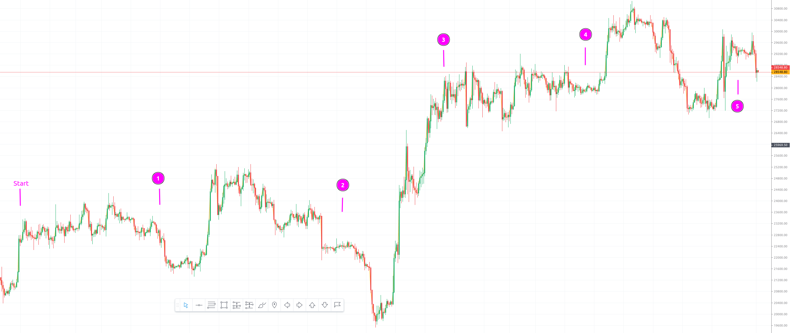
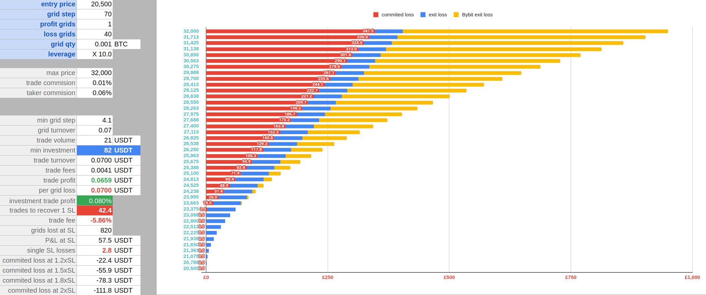

# BTCUSDT Live market for last 3 months (21 Jan to 29 Apr) with grid step 70

All experiments done with a 0.001 BTC trade qty. Market moved differently for the last 3 months 
with the following breakpoints:

* 2023-02-09 12:00 - plain smooth market with 2k spread
* 2023-03-03 09:00 - bigger volatility with 4k spread but still kind of plain market
* 2023-03-18 00:00 - drastic move for about 10k from 22k to 19k and then to 28.5k
* 2023-04-09 12:00 - slow smooth market with 2.5k spread
* 2023-04-29 16:00 - more volatile market with 4k spread

Look at the market graph 

Standard Bybit futures grid bot with 80 grids (+/- 40 SL) would have the following performance on the market:

* rough investment to cover the whole 80 grids is 164 USDT (21 USDT per trade with 10x leverage)
* 25% Stop Loss -> exit at 22800 with -41 USDT
* 50% Stop Loss -> exit at 24600 with -82 USDT
* No stop loss -> liquidation at 25300 with -164 USDT (-100%)
* +100% additional investment -> liquidation at 26700 with -310 USDT (-200%)
* +400% additional investment -> liquidation at 30800 with -770 USDT (-500%)

Overall best performance so far

4|50-5     | Step 70    TP 2    SL 50    Cling 5-5    Air >25% => -100% 200/300 => 600    x0.5
4|50-5     | 2023-02-09 12:00  +35.77 /  +55.06 USDT ( 64.97% ) ->  +40.48   +0.00 =  +40.48 { +334 / -0 }
4|50-5     | 2023-03-03 09:00  +83.90 /  +77.32 USDT ( 108.51% ) ->  +92.82   -9.17 =  +83.65 { +776 / -14 }
4|50-5     | 2023-03-18 00:00 +112.55 /  +93.54 USDT ( 120.32% ) -> +155.01  -17.21 = +137.80 { +1354 / -31 }
4|50-5     | 2023-04-09 12:00 +125.67 /  +98.03 USDT ( 128.20% ) -> +228.81  -98.92 = +129.89 { +2029 / -147 }
4|50-5     | 2023-04-29 16:00 +160.84 /  +98.03 USDT ( 164.08% ) -> +288.56 -129.94 = +158.62 { +2580 / -187 }

6|50-15    | Step 70    TP 2    SL 50    Cling 15-15    Air >25% => -50% 200/300 => 600    x0.5
6|50-15    | 2023-02-09 12:00  +35.77 /  +55.06 USDT ( 64.97% ) ->  +40.48   +0.00 =  +40.48 { +334 / -0 }
6|50-15    | 2023-03-03 09:00  +86.65 /  +77.32 USDT ( 112.07% ) ->  +92.87   -5.77 =  +87.10 { +777 / -6 }
6|50-15    | 2023-03-18 00:00 +102.16 /  +97.89 USDT ( 104.37% ) -> +154.06  -26.65 = +127.42 { +1349 / -35 }
6|50-15    | 2023-04-09 12:00 +159.77 / +112.04 USDT ( 142.60% ) -> +237.00  -77.92 = +159.08 { +2086 / -75 }
6|50-15    | 2023-04-29 16:00 +172.99 / +112.04 USDT ( 154.40% ) -> +295.67 -121.82 = +173.85 { +2626 / -116 }

or

6|50-15    | Step 70    TP 2    SL 50    Cling 15-15    Air >75% => -100% 200/300 => 600    x1.0
6|50-15    | 2023-02-09 12:00  +40.51 /  +57.44 USDT ( 70.53% ) ->  +45.21   +0.00 =  +45.21 { +334 / -0 }
6|50-15    | 2023-03-03 09:00 +101.58 /  +82.18 USDT ( 123.61% ) -> +105.14   +0.00 = +105.14 { +777 / -0 }
6|50-15    | 2023-03-18 00:00 +123.11 / +113.98 USDT ( 108.01% ) -> +184.99  -10.51 = +174.48 { +1377 / -6 }
6|50-15    | 2023-04-09 12:00 +153.58 / +121.65 USDT ( 126.25% ) -> +277.09  -61.24 = +215.85 { +2072 / -44 }
6|50-15    | 2023-04-29 16:00 +242.05 / +121.65 USDT ( 198.98% ) -> +354.26  -61.24 = +293.02 { +2647 / -44 }

## Step 70 take profit 1 grid

Best performance so far

10|70-1-40 | Step 70    TP 1    SL 40    Cling 15-15    Air >75% => -75% 200/300 => 400    x1.0
10|70-1-40 | 2023-02-09 12:00  +42.25 /  +52.59 USDT ( 80.33% ) ->  +42.30   +0.00 =  +42.30 { +647 / -0 }
10|70-1-40 | 2023-03-03 09:00  +81.55 /  +77.43 USDT ( 105.33% ) ->  +95.69   +0.00 =  +95.69 { +1465 / -0 }
10|70-1-40 | 2023-03-18 00:00   +2.96 /  +99.68 USDT ( 2.97% ) -> +159.78 -143.38 =  +16.40 { +2491 / -98 }
10|70-1-40 | 2023-04-09 12:00  +69.74 / +106.33 USDT ( 65.59% ) -> +247.27 -172.93 =  +74.35 { +3861 / -121 }
10|70-1-40 | 2023-04-29 16:00 +135.31 / +110.32 USDT ( 122.66% ) -> +311.84 -177.83 = +134.01 { +4869 / -125 }

or

15|70-1-50 | Step 70    TP 1    SL 50    Cling 15-15    Air >25% => -25% 200/300 => 600    x1.0
15|70-1-50 | 2023-02-09 12:00  +42.25 /  +52.59 USDT ( 80.33% ) ->  +42.30   +0.00 =  +42.30 { +647 / -0 }
15|70-1-50 | 2023-03-03 09:00  +77.61 /  +77.43 USDT ( 100.23% ) ->  +95.43   -7.71 =  +87.72 { +1465 / -9 }
15|70-1-50 | 2023-03-18 00:00  +37.92 / +135.41 USDT ( 28.00% ) -> +162.44  -64.83 =  +97.61 { +2504 / -37 }
15|70-1-50 | 2023-04-09 12:00  +94.26 / +136.25 USDT ( 69.18% ) -> +249.65 -155.94 =  +93.71 { +3881 / -82 }
15|70-1-50 | 2023-04-29 16:00 +114.85 / +136.25 USDT ( 84.29% ) -> +312.22 -196.59 = +115.64 { +4872 / -112 }

16|70-1-50 | Step 70    TP 1    SL 50    Cling 20-20    Air >25% => -25% 200/300 => 600    x1.0
16|70-1-50 | 2023-02-09 12:00  +42.25 /  +52.59 USDT ( 80.33% ) ->  +42.30   +0.00 =  +42.30 { +647 / -0 }
16|70-1-50 | 2023-03-03 09:00  +77.61 /  +77.43 USDT ( 100.23% ) ->  +95.43   -7.71 =  +87.72 { +1465 / -9 }
16|70-1-50 | 2023-03-18 00:00  +39.93 / +131.97 USDT ( 30.26% ) -> +162.23  -76.31 =  +85.92 { +2503 / -41 }
16|70-1-50 | 2023-04-09 12:00  +95.28 / +131.97 USDT ( 72.20% ) -> +249.70 -154.98 =  +94.72 { +3882 / -82 }
16|70-1-50 | 2023-04-29 16:00 +121.39 / +131.97 USDT ( 91.98% ) -> +312.54 -189.04 = +123.50 { +4875 / -108 }

Other worst and best examples

### 70-1-10

0|70-1-10- | Step 70    TP 1    SL 10    Cling 0-0    Air >25% => -75% 200/300 => 300    x1.0
0|70-1-10- | 2023-02-09 12:00  +13.10 /  +35.46 USDT ( 36.95% ) ->  +37.79  -25.56 =  +12.23 { +612 / -80 }
0|70-1-10- | 2023-03-03 09:00  -16.73 /  +35.61 USDT ( -46.98% ) ->  +80.62 -100.06 =  -19.45 { +1357 / -284 }
0|70-1-10- | 2023-03-18 00:00  -55.83 /  +38.69 USDT ( -144.29% ) -> +136.10 -197.76 =  -61.66 { +2332 / -570 }
0|70-1-10- | 2023-04-09 12:00  -67.96 /  +43.56 USDT ( -156.02% ) -> +210.90 -287.87 =  -76.97 { +3630 / -834 }
0|70-1-10- | 2023-04-29 16:00 -103.68 /  +44.91 USDT ( -230.85% ) -> +261.98 -376.28 = -114.30 { +4545 / -1055 }

1|70-1-10- | Step 70    TP 1    SL 10    Cling 5-5    Air >75% => -100% 200/300 => 300    x0.5
1|70-1-10- | 2023-02-09 12:00  +10.69 /  +33.01 USDT ( 32.38% ) ->  +33.69  -21.22 =  +12.47 { +597 / -59 }
1|70-1-10- | 2023-03-03 09:00  -10.17 /  +35.18 USDT ( -28.92% ) ->  +71.58  -75.76 =   -4.18 { +1327 / -205 }
1|70-1-10- | 2023-03-18 00:00  -32.22 /  +37.16 USDT ( -86.70% ) -> +118.26 -140.08 =  -21.82 { +2310 / -381 }
1|70-1-10- | 2023-04-09 12:00  -32.24 /  +42.27 USDT ( -76.28% ) -> +183.31 -198.34 =  -15.03 { +3591 / -541 }
1|70-1-10- | 2023-04-29 16:00  -49.19 /  +44.43 USDT ( -110.71% ) -> +228.16 -256.95 =  -28.80 { +4506 / -682 }

### 70-1-20

2|70-1-20- | Step 70    TP 1    SL 20    Cling 0-0    Air >25% => -100% 200/300 => 300    x1.0
2|70-1-20- | 2023-02-09 12:00   +9.62 /  +37.48 USDT ( 25.67% ) ->  +36.73  -28.64 =   +8.09 { +609 / -111 }
2|70-1-20- | 2023-03-03 09:00  -17.42 /  +51.47 USDT ( -33.85% ) ->  +78.46 -100.55 =  -22.09 { +1355 / -355 }
2|70-1-20- | 2023-03-18 00:00  -58.57 /  +64.88 USDT ( -90.28% ) -> +134.21 -202.37 =  -68.17 { +2351 / -682 }
2|70-1-20- | 2023-04-09 12:00  -61.69 /  +64.88 USDT ( -95.08% ) -> +210.04 -283.11 =  -73.07 { +3679 / -964 }
2|70-1-20- | 2023-04-29 16:00  -90.07 /  +69.19 USDT ( -130.18% ) -> +261.76 -364.47 = -102.71 { +4619 / -1205 }

2|70-1-20- | Step 70    TP 1    SL 20    Cling 0-0    Air >25% => -100% 200/300 => 600    x0.5
2|70-1-20- | 2023-02-09 12:00  +33.97 /  +45.90 USDT ( 74.00% ) ->  +37.96   -4.08 =  +33.87 { +645 / -16 }
2|70-1-20- | 2023-03-03 09:00  +24.81 /  +57.57 USDT ( 43.10% ) ->  +81.46  -56.36 =  +25.09 { +1409 / -77 }
2|70-1-20- | 2023-03-18 00:00  -22.60 /  +62.31 USDT ( -36.26% ) -> +129.02 -130.58 =   -1.56 { +2382 / -191 }
2|70-1-20- | 2023-04-09 12:00  +19.59 /  +68.62 USDT ( 28.55% ) -> +204.14 -168.04 =  +36.10 { +3763 / -276 }
2|70-1-20- | 2023-04-29 16:00  -14.72 /  +73.86 USDT ( -19.92% ) -> +250.60 -234.44 =  +16.16 { +4684 / -399 }

### 70-1-30

7|70-1-30- | Step 70    TP 1    SL 30    Cling 5-5    Air >75% => -100% 200/300 => 400    x1.0
7|70-1-30- | 2023-02-09 12:00  +42.25 /  +52.59 USDT ( 80.33% ) ->  +42.30   +0.00 =  +42.30 { +647 / -0 }
7|70-1-30- | 2023-03-03 09:00  +27.99 /  +77.43 USDT ( 36.15% ) ->  +91.91  -64.33 =  +27.58 { +1439 / -74 }
7|70-1-30- | 2023-03-18 00:00  -59.64 /  +91.58 USDT ( -65.13% ) -> +153.71 -216.23 =  -62.52 { +2463 / -248 }
7|70-1-30- | 2023-04-09 12:00 -108.87 /  +93.41 USDT ( -116.55% ) -> +233.14 -343.94 = -110.80 { +3771 / -393 }
7|70-1-30- | 2023-04-29 16:00 -187.26 /  +93.41 USDT ( -200.47% ) -> +288.24 -483.02 = -194.78 { +4718 / -557 }

5|70-1-30- | Step 70    TP 1    SL 30    Cling 10-10    Air >75% => -100% 200/300 => 400    x0.5
5|70-1-30- | 2023-02-09 12:00  +37.70 /  +41.96 USDT ( 89.86% ) ->  +37.76   +0.00 =  +37.76 { +647 / -0 }
5|70-1-30- | 2023-03-03 09:00  +53.87 /  +63.54 USDT ( 84.78% ) ->  +83.87   -7.69 =  +76.17 { +1458 / -10 }
5|70-1-30- | 2023-03-18 00:00  +12.66 /  +74.52 USDT ( 16.99% ) -> +136.12  -88.33 =  +47.79 { +2475 / -86 }
5|70-1-30- | 2023-04-09 12:00  +53.51 /  +84.25 USDT ( 63.52% ) -> +210.32 -132.24 =  +78.08 { +3820 / -130 }
5|70-1-30- | 2023-04-29 16:00  +51.44 /  +84.66 USDT ( 60.77% ) -> +262.23 -191.69 =  +70.55 { +4808 / -189 }
4|70-1-30- | Step 70    TP 1    SL 30    Cling 0-0    Air >75% => -100% 200/300 => 500    x0.5
4|70-1-30- | 2023-02-09 12:00  +37.70 /  +41.96 USDT ( 89.86% ) ->  +37.76   +0.00 =  +37.76 { +647 / -0 }
4|70-1-30- | 2023-03-03 09:00  +61.89 /  +71.23 USDT ( 86.90% ) ->  +84.37   -0.10 =  +84.27 { +1461 / -3 }
4|70-1-30- | 2023-03-18 00:00  +38.77 /  +80.45 USDT ( 48.19% ) -> +137.85  -56.75 =  +81.10 { +2488 / -61 }
4|70-1-30- | 2023-04-09 12:00  +31.96 /  +93.61 USDT ( 34.14% ) -> +209.47 -119.44 =  +90.02 { +3813 / -126 }
4|70-1-30- | 2023-04-29 16:00  +29.75 /  +95.08 USDT ( 31.28% ) -> +260.87 -180.25 =  +80.62 { +4781 / -175 }

### 70-1-40

12|70-1-40 | Step 70    TP 1    SL 40    Cling 5-5    Air >50% => -100% 200/300 => 400    x1.0
12|70-1-40 | 2023-02-09 12:00  +42.25 /  +52.59 USDT ( 80.33% ) ->  +42.30   +0.00 =  +42.30 { +647 / -0 }
12|70-1-40 | 2023-03-03 09:00   -3.47 /  +77.77 USDT ( -4.46% ) ->  +89.17  -94.09 =   -4.92 { +1416 / -117 }
12|70-1-40 | 2023-03-18 00:00  -94.29 /  +99.68 USDT ( -94.60% ) -> +151.67 -249.15 =  -97.48 { +2448 / -286 }
12|70-1-40 | 2023-04-09 12:00 -102.67 /  +99.68 USDT ( -103.01% ) -> +233.44 -339.50 = -106.07 { +3782 / -412 }
12|70-1-40 | 2023-04-29 16:00 -142.41 /  +99.68 USDT ( -142.87% ) -> +290.54 -440.06 = -149.53 { +4741 / -540 }

8|70-1-40- | Step 70    TP 1    SL 40    Cling 0-0    Air >75% => -75% 200/300 => 400    x1.0
8|70-1-40- | 2023-02-09 12:00  +42.25 /  +52.59 USDT ( 80.33% ) ->  +42.30   +0.00 =  +42.30 { +647 / -0 }
8|70-1-40- | 2023-03-03 09:00  +81.55 /  +77.43 USDT ( 105.33% ) ->  +95.69   +0.00 =  +95.69 { +1465 / -0 }
8|70-1-40- | 2023-03-18 00:00   -6.56 /  +99.68 USDT ( -6.58% ) -> +159.89 -153.02 =   +6.87 { +2493 / -99 }
8|70-1-40- | 2023-04-09 12:00  +60.22 / +106.33 USDT ( 56.64% ) -> +247.38 -182.56 =  +64.82 { +3863 / -122 }
8|70-1-40- | 2023-04-29 16:00 +131.23 / +110.32 USDT ( 118.96% ) -> +312.54 -182.56 = +129.98 { +4878 / -122 }
12|70-1-40 | Step 70    TP 1    SL 40    Cling 5-5    Air >75% => -75% 200/300 => 400    x1.0
12|70-1-40 | 2023-02-09 12:00  +42.25 /  +52.59 USDT ( 80.33% ) ->  +42.30   +0.00 =  +42.30 { +647 / -0 }
12|70-1-40 | 2023-03-03 09:00  +81.55 /  +77.43 USDT ( 105.33% ) ->  +95.69   +0.00 =  +95.69 { +1465 / -0 }
12|70-1-40 | 2023-03-18 00:00   -6.56 /  +99.68 USDT ( -6.58% ) -> +159.89 -153.02 =   +6.87 { +2493 / -99 }
12|70-1-40 | 2023-04-09 12:00  +60.22 / +106.33 USDT ( 56.64% ) -> +247.38 -182.56 =  +64.82 { +3863 / -122 }
12|70-1-40 | 2023-04-29 16:00 +131.23 / +110.32 USDT ( 118.96% ) -> +312.54 -182.56 = +129.98 { +4878 / -122 }
9|70-1-40- | Step 70    TP 1    SL 40    Cling 10-10    Air >75% => -100% 200/300 => 300    x0.5
9|70-1-40- | 2023-02-09 12:00  +37.70 /  +41.96 USDT ( 89.86% ) ->  +37.76   +0.00 =  +37.76 { +647 / -0 }
9|70-1-40- | 2023-03-03 09:00  +71.21 /  +71.23 USDT ( 99.97% ) ->  +85.08   +0.00 =  +85.08 { +1465 / -0 }
9|70-1-40- | 2023-03-18 00:00  +17.15 /  +97.71 USDT ( 17.55% ) -> +137.34 -121.10 =  +16.23 { +2512 / -108 }
9|70-1-40- | 2023-04-09 12:00  +51.01 / +100.89 USDT ( 50.57% ) -> +212.28 -157.24 =  +55.04 { +3861 / -142 }
9|70-1-40- | 2023-04-29 16:00 +106.48 / +100.89 USDT ( 105.54% ) -> +267.09 -162.17 = +104.92 { +4866 / -145 }
10|70-1-40 | Step 70    TP 1    SL 40    Cling 15-15    Air >75% => -75% 200/300 => 400    x1.0
10|70-1-40 | 2023-02-09 12:00  +42.25 /  +52.59 USDT ( 80.33% ) ->  +42.30   +0.00 =  +42.30 { +647 / -0 }
10|70-1-40 | 2023-03-03 09:00  +81.55 /  +77.43 USDT ( 105.33% ) ->  +95.69   +0.00 =  +95.69 { +1465 / -0 }
10|70-1-40 | 2023-03-18 00:00   +2.96 /  +99.68 USDT ( 2.97% ) -> +159.78 -143.38 =  +16.40 { +2491 / -98 }
10|70-1-40 | 2023-04-09 12:00  +69.74 / +106.33 USDT ( 65.59% ) -> +247.27 -172.93 =  +74.35 { +3861 / -121 }
10|70-1-40 | 2023-04-29 16:00 +135.31 / +110.32 USDT ( 122.66% ) -> +311.84 -177.83 = +134.01 { +4869 / -125 }

### 70-1-50

13|70-1-50 | Step 70    TP 1    SL 50    Cling 0-0    Air >50% => -100% 200/300 => 400    x1.0
13|70-1-50 | 2023-02-09 12:00  +42.25 /  +52.59 USDT ( 80.33% ) ->  +42.30   +0.00 =  +42.30 { +647 / -0 }
13|70-1-50 | 2023-03-03 09:00  +22.14 /  +77.43 USDT ( 28.59% ) ->  +91.53  -69.17 =  +22.36 { +1435 / -78 }
13|70-1-50 | 2023-03-18 00:00  -53.07 /  +99.68 USDT ( -53.24% ) -> +154.95 -210.25 =  -55.29 { +2467 / -216 }
13|70-1-50 | 2023-04-09 12:00 -100.02 /  +99.68 USDT ( -100.34% ) -> +234.82 -333.24 =  -98.42 { +3775 / -348 }
13|70-1-50 | 2023-04-29 16:00 -179.66 /  +99.68 USDT ( -180.25% ) -> +290.52 -476.71 = -186.19 { +4727 / -504 }

13|70-1-50 | Step 70    TP 1    SL 50    Cling 0-0    Air >75% => -75% 200/300 => 400    x1.0
13|70-1-50 | 2023-02-09 12:00  +42.25 /  +52.59 USDT ( 80.33% ) ->  +42.30   +0.00 =  +42.30 { +647 / -0 }
13|70-1-50 | 2023-03-03 09:00  +81.55 /  +77.43 USDT ( 105.33% ) ->  +95.69   +0.00 =  +95.69 { +1465 / -0 }
13|70-1-50 | 2023-03-18 00:00   -5.46 / +110.24 USDT ( -4.95% ) -> +160.00 -147.24 =  +12.76 { +2488 / -85 }
13|70-1-50 | 2023-04-09 12:00  +40.93 / +129.84 USDT ( 31.53% ) -> +246.59 -200.98 =  +45.61 { +3848 / -115 }
13|70-1-50 | 2023-04-29 16:00 +111.95 / +129.84 USDT ( 86.22% ) -> +311.75 -200.98 = +110.77 { +4863 / -115 }
14|70-1-50 | Step 70    TP 1    SL 50    Cling 10-10    Air >75% => -75% 200/300 => 300    x1.0
14|70-1-50 | 2023-02-09 12:00  +42.25 /  +52.59 USDT ( 80.33% ) ->  +42.30   +0.00 =  +42.30 { +647 / -0 }
14|70-1-50 | 2023-03-03 09:00  +81.55 /  +77.43 USDT ( 105.33% ) ->  +95.69   +0.00 =  +95.69 { +1465 / -0 }
14|70-1-50 | 2023-03-18 00:00   -7.36 / +110.24 USDT ( -6.67% ) -> +160.00 -149.14 =  +10.86 { +2488 / -85 }
14|70-1-50 | 2023-04-09 12:00  +39.04 / +129.84 USDT ( 30.06% ) -> +246.59 -202.88 =  +43.71 { +3848 / -115 }
14|70-1-50 | 2023-04-29 16:00 +110.05 / +129.84 USDT ( 84.75% ) -> +311.75 -202.88 = +108.87 { +4863 / -115 }
15|70-1-50 | Step 70    TP 1    SL 50    Cling 15-15    Air >25% => -25% 200/300 => 600    x1.0
15|70-1-50 | 2023-02-09 12:00  +42.25 /  +52.59 USDT ( 80.33% ) ->  +42.30   +0.00 =  +42.30 { +647 / -0 }
15|70-1-50 | 2023-03-03 09:00  +77.61 /  +77.43 USDT ( 100.23% ) ->  +95.43   -7.71 =  +87.72 { +1465 / -9 }
15|70-1-50 | 2023-03-18 00:00  +37.92 / +135.41 USDT ( 28.00% ) -> +162.44  -64.83 =  +97.61 { +2504 / -37 }
15|70-1-50 | 2023-04-09 12:00  +94.26 / +136.25 USDT ( 69.18% ) -> +249.65 -155.94 =  +93.71 { +3881 / -82 }
15|70-1-50 | 2023-04-29 16:00 +114.85 / +136.25 USDT ( 84.29% ) -> +312.22 -196.59 = +115.64 { +4872 / -112 }
16|70-1-50 | Step 70    TP 1    SL 50    Cling 20-20    Air >25% => -25% 200/300 => 600    x1.0
16|70-1-50 | 2023-02-09 12:00  +42.25 /  +52.59 USDT ( 80.33% ) ->  +42.30   +0.00 =  +42.30 { +647 / -0 }
16|70-1-50 | 2023-03-03 09:00  +77.61 /  +77.43 USDT ( 100.23% ) ->  +95.43   -7.71 =  +87.72 { +1465 / -9 }
16|70-1-50 | 2023-03-18 00:00  +39.93 / +131.97 USDT ( 30.26% ) -> +162.23  -76.31 =  +85.92 { +2503 / -41 }
16|70-1-50 | 2023-04-09 12:00  +95.28 / +131.97 USDT ( 72.20% ) -> +249.70 -154.98 =  +94.72 { +3882 / -82 }
16|70-1-50 | 2023-04-29 16:00 +121.39 / +131.97 USDT ( 91.98% ) -> +312.54 -189.04 = +123.50 { +4875 / -108 }

## Step 70 take profit 2 grids

Best performance so far

4|50-5     | Step 70    TP 2    SL 50    Cling 5-5    Air >25% => -100% 200/300 => 600    x0.5
4|50-5     | 2023-02-09 12:00  +35.77 /  +55.06 USDT ( 64.97% ) ->  +40.48   +0.00 =  +40.48 { +334 / -0 }
4|50-5     | 2023-03-03 09:00  +83.90 /  +77.32 USDT ( 108.51% ) ->  +92.82   -9.17 =  +83.65 { +776 / -14 }
4|50-5     | 2023-03-18 00:00 +112.55 /  +93.54 USDT ( 120.32% ) -> +155.01  -17.21 = +137.80 { +1354 / -31 }
4|50-5     | 2023-04-09 12:00 +125.67 /  +98.03 USDT ( 128.20% ) -> +228.81  -98.92 = +129.89 { +2029 / -147 }
4|50-5     | 2023-04-29 16:00 +160.84 /  +98.03 USDT ( 164.08% ) -> +288.56 -129.94 = +158.62 { +2580 / -187 }

6|50-15    | Step 70    TP 2    SL 50    Cling 15-15    Air >25% => -50% 200/300 => 600    x0.5
6|50-15    | 2023-02-09 12:00  +35.77 /  +55.06 USDT ( 64.97% ) ->  +40.48   +0.00 =  +40.48 { +334 / -0 }
6|50-15    | 2023-03-03 09:00  +86.65 /  +77.32 USDT ( 112.07% ) ->  +92.87   -5.77 =  +87.10 { +777 / -6 }
6|50-15    | 2023-03-18 00:00 +102.16 /  +97.89 USDT ( 104.37% ) -> +154.06  -26.65 = +127.42 { +1349 / -35 }
6|50-15    | 2023-04-09 12:00 +159.77 / +112.04 USDT ( 142.60% ) -> +237.00  -77.92 = +159.08 { +2086 / -75 }
6|50-15    | 2023-04-29 16:00 +172.99 / +112.04 USDT ( 154.40% ) -> +295.67 -121.82 = +173.85 { +2626 / -116 }

or

6|50-15    | Step 70    TP 2    SL 50    Cling 15-15    Air >75% => -100% 200/300 => 600    x1.0
6|50-15    | 2023-02-09 12:00  +40.51 /  +57.44 USDT ( 70.53% ) ->  +45.21   +0.00 =  +45.21 { +334 / -0 }
6|50-15    | 2023-03-03 09:00 +101.58 /  +82.18 USDT ( 123.61% ) -> +105.14   +0.00 = +105.14 { +777 / -0 }
6|50-15    | 2023-03-18 00:00 +123.11 / +113.98 USDT ( 108.01% ) -> +184.99  -10.51 = +174.48 { +1377 / -6 }
6|50-15    | 2023-04-09 12:00 +153.58 / +121.65 USDT ( 126.25% ) -> +277.09  -61.24 = +215.85 { +2072 / -44 }
6|50-15    | 2023-04-29 16:00 +242.05 / +121.65 USDT ( 198.98% ) -> +354.26  -61.24 = +293.02 { +2647 / -44 }

Other worst and best examples

### 70-2-20

0|20-5     | Step 70    TP 2    SL 20    Cling 5-5    Air >50% => -100% 200/300 => 500    x1.0
0|20-5     | 2023-02-09 12:00   -1.44 /  +57.95 USDT ( -2.49% ) ->  +40.36  -36.01 =   +4.36 { +309 / -53 }
0|20-5     | 2023-03-03 09:00  -12.16 /  +58.19 USDT ( -20.89% ) ->  +90.41  -90.11 =   +0.30 { +702 / -146 }
0|20-5     | 2023-03-18 00:00  -65.85 /  +66.16 USDT ( -99.53% ) -> +157.02 -213.01 =  -55.99 { +1232 / -323 }
0|20-5     | 2023-04-09 12:00  -32.49 /  +66.16 USDT ( -49.11% ) -> +247.58 -271.79 =  -24.21 { +1932 / -428 }
0|20-5     | 2023-04-29 16:00  -68.56 /  +71.91 USDT ( -95.34% ) -> +308.53 -355.94 =  -47.41 { +2426 / -563 }

0|20-5     | Step 70    TP 2    SL 20    Cling 5-5    Air >75% => -100% 200/400 => 400    x1.0
0|20-5     | 2023-02-09 12:00  +24.14 /  +57.95 USDT ( 41.65% ) ->  +43.18  -18.72 =  +24.47 { +324 / -25 }
0|20-5     | 2023-03-03 09:00  +46.78 /  +57.95 USDT ( 80.73% ) ->  +98.21  -51.13 =  +47.08 { +742 / -78 }
0|20-5     | 2023-03-18 00:00  +11.43 /  +65.56 USDT ( 17.44% ) -> +166.57 -158.30 =   +8.27 { +1283 / -245 }
0|20-5     | 2023-04-09 12:00  +76.80 /  +65.56 USDT ( 117.15% ) -> +261.36 -188.60 =  +72.76 { +2002 / -300 }
0|20-5     | 2023-04-29 16:00  +63.79 /  +65.70 USDT ( 97.09% ) -> +326.14 -266.36 =  +59.78 { +2516 / -421 }
0|20-5     | Step 70    TP 2    SL 20    Cling 5-5    Air >75% => -100% 200/300 => 400    x1.0
0|20-5     | 2023-02-09 12:00  +24.14 /  +57.95 USDT ( 41.65% ) ->  +43.18  -18.72 =  +24.47 { +324 / -25 }
0|20-5     | 2023-03-03 09:00  +46.78 /  +57.95 USDT ( 80.73% ) ->  +98.21  -51.13 =  +47.08 { +742 / -78 }
0|20-5     | 2023-03-18 00:00  +11.43 /  +65.56 USDT ( 17.44% ) -> +166.57 -158.30 =   +8.27 { +1283 / -245 }
0|20-5     | 2023-04-09 12:00  +76.80 /  +65.56 USDT ( 117.15% ) -> +261.36 -188.60 =  +72.76 { +2002 / -300 }
0|20-5     | 2023-04-29 16:00  +63.79 /  +65.70 USDT ( 97.09% ) -> +326.14 -266.36 =  +59.78 { +2516 / -421 }

### 70-2-30

1|30-5     | Step 70    TP 2    SL 30    Cling 5-5    Air >25% => -75% 200/400 => 500    x0.5
1|30-5     | 2023-02-09 12:00   +5.57 /  +67.30 USDT ( 8.28% ) ->  +38.63  -18.48 =  +20.14 { +315 / -29 }
1|30-5     | 2023-03-03 09:00  -13.18 /  +76.71 USDT ( -17.18% ) ->  +86.31 -100.49 =  -14.18 { +713 / -134 }
1|30-5     | 2023-03-18 00:00  -89.61 /  +90.39 USDT ( -99.13% ) -> +144.64 -235.53 =  -90.89 { +1263 / -256 }
1|30-5     | 2023-04-09 12:00  -47.87 /  +90.39 USDT ( -52.96% ) -> +226.97 -277.85 =  -50.89 { +1968 / -335 }
1|30-5     | 2023-04-29 16:00  -81.76 /  +94.73 USDT ( -86.31% ) -> +284.47 -370.13 =  -85.67 { +2488 / -452 }

1|30-5     | Step 70    TP 2    SL 30    Cling 5-5    Air >50% => -50% 200/400 => 400    x0.5
1|30-5     | 2023-02-09 12:00  +33.63 /  +51.85 USDT ( 64.85% ) ->  +41.21   -7.67 =  +33.54 { +333 / -8 }
1|30-5     | 2023-03-03 09:00  +77.83 /  +58.44 USDT ( 133.19% ) ->  +97.96  -20.13 =  +77.84 { +776 / -22 }
1|30-5     | 2023-03-18 00:00   -8.10 /  +77.28 USDT ( -10.48% ) -> +155.71 -160.11 =   -4.40 { +1315 / -152 }
1|30-5     | 2023-04-09 12:00  +55.75 /  +77.28 USDT ( 72.15% ) -> +242.51 -188.72 =  +53.79 { +2046 / -180 }
1|30-5     | 2023-04-29 16:00  +64.35 /  +77.28 USDT ( 83.27% ) -> +303.63 -241.91 =  +61.72 { +2584 / -237 }

### 70-2-40

2|40-5     | Step 70    TP 2    SL 40    Cling 5-5    Air >75% => -100% 200/300 => 500    x1.0
2|40-5     | 2023-02-09 12:00  +40.51 /  +57.44 USDT ( 70.53% ) ->  +45.21   +0.00 =  +45.21 { +334 / -0 }
2|40-5     | 2023-03-03 09:00 +101.58 /  +82.18 USDT ( 123.61% ) -> +105.14   +0.00 = +105.14 { +777 / -0 }
2|40-5     | 2023-03-18 00:00 -121.01 / +117.16 USDT ( -103.28% ) -> +166.93 -290.39 = -123.46 { +1280 / -216 }
2|40-5     | 2023-04-09 12:00  -96.86 / +117.16 USDT ( -82.67% ) -> +258.04 -355.72 =  -97.68 { +1973 / -278 }
2|40-5     | 2023-04-29 16:00 -127.93 / +118.58 USDT ( -107.88% ) -> +325.89 -447.89 = -122.00 { +2497 / -350 }

2|40-5     | Step 70    TP 2    SL 40    Cling 5-5    Air >75% => -100% 200/400 => 400    x0.5
2|40-5     | 2023-02-09 12:00  +37.40 /  +55.06 USDT ( 67.92% ) ->  +42.10   +0.00 =  +42.10 { +334 / -0 }
2|40-5     | 2023-03-03 09:00  +94.74 /  +78.39 USDT ( 120.87% ) ->  +98.31   +0.00 =  +98.31 { +777 / -0 }
2|40-5     | 2023-03-18 00:00  +34.99 / +107.61 USDT ( 32.52% ) -> +158.75 -124.64 =  +34.10 { +1339 / -107 }
2|40-5     | 2023-04-09 12:00  +77.20 / +107.61 USDT ( 71.74% ) -> +242.27 -160.72 =  +81.54 { +2039 / -140 }
2|40-5     | 2023-04-29 16:00 +149.83 / +107.61 USDT ( 139.24% ) -> +309.09 -160.72 = +148.37 { +2609 / -140 }
2|40-5     | Step 70    TP 2    SL 40    Cling 5-5    Air >75% => -100% 200/300 => 600    x1.0
2|40-5     | 2023-02-09 12:00  +40.51 /  +57.44 USDT ( 70.53% ) ->  +45.21   +0.00 =  +45.21 { +334 / -0 }
2|40-5     | 2023-03-03 09:00 +101.58 /  +82.18 USDT ( 123.61% ) -> +105.14   +0.00 = +105.14 { +777 / -0 }
2|40-5     | 2023-03-18 00:00  +71.98 / +110.96 USDT ( 64.87% ) -> +180.65  -75.06 = +105.59 { +1345 / -48 }
2|40-5     | 2023-04-09 12:00 +122.68 / +123.89 USDT ( 99.02% ) -> +276.43 -154.95 = +121.49 { +2070 / -97 }
2|40-5     | 2023-04-29 16:00 +166.08 / +130.64 USDT ( 127.13% ) -> +350.17 -185.40 = +164.77 { +2623 / -110 }
2|40-5     | Step 70    TP 2    SL 40    Cling 5-5    Air >75% => -75% 200/300 => 300    x1.0
2|40-5     | 2023-02-09 12:00  +40.51 /  +57.44 USDT ( 70.53% ) ->  +45.21   +0.00 =  +45.21 { +334 / -0 }
2|40-5     | 2023-03-03 09:00 +101.58 /  +82.18 USDT ( 123.61% ) -> +105.14   +0.00 = +105.14 { +777 / -0 }
2|40-5     | 2023-03-18 00:00  +35.72 /  +96.19 USDT ( 37.13% ) -> +177.89 -131.64 =  +46.25 { +1335 / -93 }
2|40-5     | 2023-04-09 12:00 +105.81 / +103.26 USDT ( 102.47% ) -> +273.73 -166.65 = +107.08 { +2054 / -117 }
2|40-5     | 2023-04-29 16:00 +147.50 / +109.60 USDT ( 134.58% ) -> +347.36 -201.49 = +145.87 { +2609 / -141 }
3|40-10    | Step 70    TP 2    SL 40    Cling 10-10    Air >75% => -100% 200/300 => 300    x0.5
3|40-10    | 2023-02-09 12:00  +35.77 /  +55.06 USDT ( 64.97% ) ->  +40.48   +0.00 =  +40.48 { +334 / -0 }
3|40-10    | 2023-03-03 09:00  +89.47 /  +77.32 USDT ( 115.71% ) ->  +93.03   +0.00 =  +93.03 { +777 / -0 }
3|40-10    | 2023-03-18 00:00  +24.84 /  +95.67 USDT ( 25.97% ) -> +148.42 -115.14 =  +33.28 { +1330 / -107 }
3|40-10    | 2023-04-09 12:00  +67.82 / +101.68 USDT ( 66.70% ) -> +227.19 -155.10 =  +72.09 { +2029 / -145 }
3|40-10    | 2023-04-29 16:00 +137.17 / +101.68 USDT ( 134.91% ) -> +291.18 -155.56 = +135.63 { +2597 / -146 }

### 70-2-50

4|50-5     | Step 70    TP 2    SL 50    Cling 5-5    Air >25% => -100% 200/300 => 500    x0.5
4|50-5     | 2023-02-09 12:00  +11.71 /  +67.30 USDT ( 17.40% ) ->  +38.05  -11.65 =  +26.41 { +320 / -17 }
4|50-5     | 2023-03-03 09:00  -28.10 /  +81.23 USDT ( -34.59% ) ->  +79.32 -107.76 =  -28.44 { +698 / -156 }
4|50-5     | 2023-03-18 00:00 -138.17 / +117.98 USDT ( -117.11% ) -> +132.59 -274.23 = -141.64 { +1237 / -316 }
4|50-5     | 2023-04-09 12:00 -111.25 / +117.98 USDT ( -94.30% ) -> +209.29 -324.94 = -115.65 { +1948 / -394 }
4|50-5     | 2023-04-29 16:00 -168.73 / +117.98 USDT ( -143.02% ) -> +260.43 -435.31 = -174.89 { +2444 / -550 }
5|50-10    | Step 70    TP 2    SL 50    Cling 10-10    Air >25% => -100% 200/300 => 500    x0.5
5|50-10    | 2023-02-09 12:00  +11.71 /  +67.30 USDT ( 17.40% ) ->  +38.05  -11.65 =  +26.41 { +320 / -17 }
5|50-10    | 2023-03-03 09:00  -28.10 /  +81.23 USDT ( -34.59% ) ->  +79.32 -107.76 =  -28.44 { +698 / -156 }
5|50-10    | 2023-03-18 00:00 -137.96 / +113.75 USDT ( -121.28% ) -> +132.62 -274.04 = -141.42 { +1237 / -315 }
5|50-10    | 2023-04-09 12:00 -111.05 / +113.75 USDT ( -97.62% ) -> +209.32 -324.76 = -115.43 { +1948 / -393 }
5|50-10    | 2023-04-29 16:00 -168.52 / +113.75 USDT ( -148.15% ) -> +260.46 -435.13 = -174.67 { +2444 / -549 }

4|50-5     | Step 70    TP 2    SL 50    Cling 5-5    Air >25% => -75% 200/400 => 400    x0.5
4|50-5     | 2023-02-09 12:00  +34.34 /  +49.68 USDT ( 69.12% ) ->  +41.49   -7.26 =  +34.23 { +333 / -15 }
4|50-5     | 2023-03-03 09:00  +54.34 /  +55.66 USDT ( 97.63% ) ->  +94.80  -41.21 =  +53.59 { +758 / -66 }
4|50-5     | 2023-03-18 00:00  +37.83 /  +74.77 USDT ( 50.59% ) -> +158.82 -122.77 =  +36.05 { +1341 / -168 }
4|50-5     | 2023-04-09 12:00 +101.48 /  +74.77 USDT ( 135.72% ) -> +247.02 -147.81 =  +99.21 { +2078 / -211 }
4|50-5     | 2023-04-29 16:00  +97.61 /  +74.77 USDT ( 130.54% ) -> +305.91 -211.70 =  +94.21 { +2604 / -299 }
4|50-5     | Step 70    TP 2    SL 50    Cling 5-5    Air >25% => -100% 200/300 => 600    x0.5
4|50-5     | 2023-02-09 12:00  +35.77 /  +55.06 USDT ( 64.97% ) ->  +40.48   +0.00 =  +40.48 { +334 / -0 }
4|50-5     | 2023-03-03 09:00  +83.90 /  +77.32 USDT ( 108.51% ) ->  +92.82   -9.17 =  +83.65 { +776 / -14 }
4|50-5     | 2023-03-18 00:00 +112.55 /  +93.54 USDT ( 120.32% ) -> +155.01  -17.21 = +137.80 { +1354 / -31 }
4|50-5     | 2023-04-09 12:00 +125.67 /  +98.03 USDT ( 128.20% ) -> +228.81  -98.92 = +129.89 { +2029 / -147 }
4|50-5     | 2023-04-29 16:00 +160.84 /  +98.03 USDT ( 164.08% ) -> +288.56 -129.94 = +158.62 { +2580 / -187 }
4|50-5     | Step 70    TP 2    SL 50    Cling 5-5    Air >50% => -75% 200/300 => 600    x1.0
4|50-5     | 2023-02-09 12:00  +40.51 /  +57.44 USDT ( 70.53% ) ->  +45.21   +0.00 =  +45.21 { +334 / -0 }
4|50-5     | 2023-03-03 09:00 +101.58 /  +82.18 USDT ( 123.61% ) -> +105.14   +0.00 = +105.14 { +777 / -0 }
4|50-5     | 2023-03-18 00:00  +63.92 / +139.80 USDT ( 45.72% ) -> +181.61  -55.54 = +126.07 { +1349 / -31 }
4|50-5     | 2023-04-09 12:00 +116.48 / +139.80 USDT ( 83.32% ) -> +273.51 -155.63 = +117.88 { +2050 / -102 }
4|50-5     | 2023-04-29 16:00 +169.92 / +139.80 USDT ( 121.54% ) -> +347.42 -178.94 = +168.48 { +2606 / -122 }
4|50-5     | Step 70    TP 2    SL 50    Cling 5-5    Air >25% => -50% 200/300 => 600    x0.5
4|50-5     | 2023-02-09 12:00  +35.77 /  +55.06 USDT ( 64.97% ) ->  +40.48   +0.00 =  +40.48 { +334 / -0 }
4|50-5     | 2023-03-03 09:00  +86.65 /  +77.32 USDT ( 112.07% ) ->  +92.87   -5.77 =  +87.10 { +777 / -6 }
4|50-5     | 2023-03-18 00:00  +97.02 /  +97.89 USDT ( 99.12% ) -> +154.12  -31.87 = +122.24 { +1348 / -36 }
4|50-5     | 2023-04-09 12:00 +154.63 / +112.04 USDT ( 138.02% ) -> +237.05  -83.15 = +153.90 { +2085 / -76 }
4|50-5     | 2023-04-29 16:00 +167.84 / +112.04 USDT ( 149.81% ) -> +295.72 -127.04 = +168.68 { +2625 / -117 }
6|50-15    | Step 70    TP 2    SL 50    Cling 15-15    Air >75% => -100% 200/300 => 600    x1.0
6|50-15    | 2023-02-09 12:00  +40.51 /  +57.44 USDT ( 70.53% ) ->  +45.21   +0.00 =  +45.21 { +334 / -0 }
6|50-15    | 2023-03-03 09:00 +101.58 /  +82.18 USDT ( 123.61% ) -> +105.14   +0.00 = +105.14 { +777 / -0 }
6|50-15    | 2023-03-18 00:00 +123.11 / +113.98 USDT ( 108.01% ) -> +184.99  -10.51 = +174.48 { +1377 / -6 }
6|50-15    | 2023-04-09 12:00 +153.58 / +121.65 USDT ( 126.25% ) -> +277.09  -61.24 = +215.85 { +2072 / -44 }
6|50-15    | 2023-04-29 16:00 +242.05 / +121.65 USDT ( 198.98% ) -> +354.26  -61.24 = +293.02 { +2647 / -44 }
6|50-15    | Step 70    TP 2    SL 50    Cling 15-15    Air >25% => -50% 200/300 => 600    x0.5
6|50-15    | 2023-02-09 12:00  +35.77 /  +55.06 USDT ( 64.97% ) ->  +40.48   +0.00 =  +40.48 { +334 / -0 }
6|50-15    | 2023-03-03 09:00  +86.65 /  +77.32 USDT ( 112.07% ) ->  +92.87   -5.77 =  +87.10 { +777 / -6 }
6|50-15    | 2023-03-18 00:00 +102.16 /  +97.89 USDT ( 104.37% ) -> +154.06  -26.65 = +127.42 { +1349 / -35 }
6|50-15    | 2023-04-09 12:00 +159.77 / +112.04 USDT ( 142.60% ) -> +237.00  -77.92 = +159.08 { +2086 / -75 }
6|50-15    | 2023-04-29 16:00 +172.99 / +112.04 USDT ( 154.40% ) -> +295.67 -121.82 = +173.85 { +2626 / -116 }